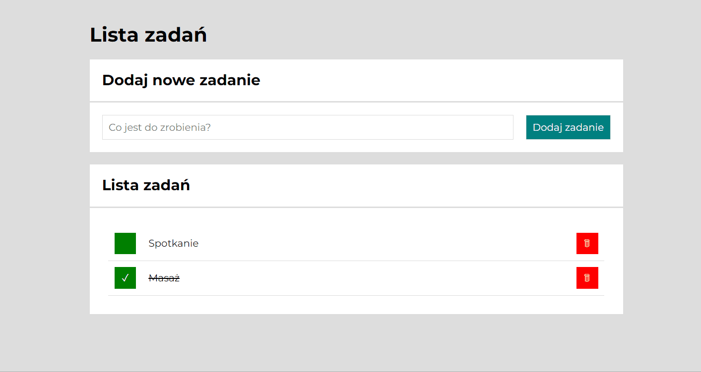

# Tasks list

## Demo

https://ulyanalakevich.github.io/todo-list-react/
## Description
This website is a tasks list. You can write there what you have to do and when you are done, delete this task or mark it is done. This website will help you for making to do lists but also for making for example shopping lists.

## Instructions
First you need to write task, and tap at the button or tap enter. Then you will see this task in your list. If you already have done your task, you can tap at the green square by left side to mark it with a tick and cross it out. If you want to  delete this task, you need to tap at the red square button by right side.

## Used technologies

HTML, CSS, JavaScript, BEM convention, ES6+ features, Normalize, GIT, React, Babel, Webpack, Media queries, Immutability, Local storage, Styled Components, Custom Hooks

This project was bootstrapped with [Create React App](https://github.com/facebook/create-react-app).

## Available Scripts

In the project directory, you can run:

### `npm start`

Runs the app in the development mode.\
Open [http://localhost:3000](http://localhost:3000) to view it in your browser.

The page will reload when you make changes.\
You may also see any lint errors in the console.

### `npm run build`

Builds the app for production to the `build` folder.\
It correctly bundles React in production mode and optimizes the build for the best performance.

The build is minified and the filenames include the hashes.\
Your app is ready to be deployed!

See the section about [deployment](https://facebook.github.io/create-react-app/docs/deployment) for more information.

### `npm run eject`

**Note: this is a one-way operation. Once you `eject`, you can't go back!**

If you aren't satisfied with the build tool and configuration choices, you can `eject` at any time. This command will remove the single build dependency from your project.

Instead, it will copy all the configuration files and the transitive dependencies (webpack, Babel, ESLint, etc) right into your project so you have full control over them. All of the commands except `eject` will still work, but they will point to the copied scripts so you can tweak them. At this point you're on your own.

You don't have to ever use `eject`. The curated feature set is suitable for small and middle deployments, and you shouldn't feel obligated to use this feature. However we understand that this tool wouldn't be useful if you couldn't customize it when you are ready for it.
